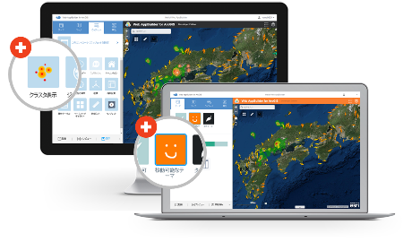

# Web AppBuilder for ArcGIS 開発コミュニティ

Web AppBuilder for ArcGIS のウィジェット/テーマを共有するための開発コミュニティです。

ArcGIS for Developers の開発者であれば、このリポジトリを介して自由にウィジェット/テーマの共有ができます。開発したウィジェット/テーマをこのコミュニティに共有するために、リポジトリへファイルを配置する場合は以下のドキュメントをご一読ください。

* [ArcGIS 開発者の貢献について](https://github.com/EsriJapan/contributing#arcgis-開発者の貢献について)

コミュニティが共有しているウィジェットとテーマを利用するために以下のドキュメントをご一読ください。

* [ウィジェットの利用方法](widgets/README.md)
* [テーマの利用方法](themes/README.md)

## 使用している製品・プロジェクト

* [Web AppBuilder for ArcGIS (Developer Edition)](https://developers.arcgis.com/web-appbuilder/)
* [ArcGIS for Developers](https://developers.arcgis.com/en/)

**ArcGIS の開発キットを使用して開発を行う場合は ArcGIS Online 開発者アカウント（[ArcGIS for Developers](https://developers.arcgis.com/en/)）が必要です。開発者アカウント作成ガイドは[こちら](http://www.esrij.com/cgi-bin/wp/wp-content/uploads/documents/signup-esri-developers.pdf)**

## リソース

* [GeoNet 開発者コミュニティ サイト](https://geonet.esri.com/groups/devcom-jp)
* [Web AppBuilder for ArcGIS (Developer Edition)｜ESRIジャパン](http://www.esrij.com/products/web-appbuilder-for-arcgis-dev/)
* [API リファレンス](https://developers.arcgis.com/web-appbuilder/api-reference/widgetmanager.htm)

## ライセンス
Copyright 2015 Esri Japan Corporation.

Apache License Version 2.0（「本ライセンス」）に基づいてライセンスされます。あなたがこのファイルを使用するためには、本ライセンスに従わなければなりません。本ライセンスのコピーは下記の場所から入手できます。

> http://www.apache.org/licenses/LICENSE-2.0

適用される法律または書面での同意によって命じられない限り、本ライセンスに基づいて頒布されるソフトウェアは、明示黙示を問わず、いかなる保証も条件もなしに「現状のまま」頒布されます。本ライセンスでの権利と制限を規定した文言については、本ライセンスを参照してください。

ライセンスのコピーは本リポジトリの[ライセンス ファイル](./LICENSE)で利用可能です。

