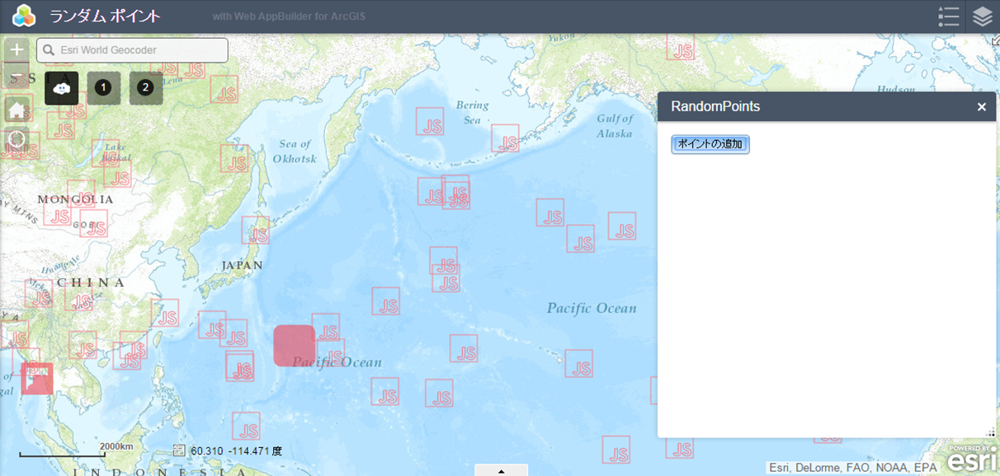

# ランダム ポイント

カスタム ウィジェット開発の参考のために作成した簡易ウィジェットです。

ボタンをクリックすると地図上の任意の地点にポイント グラフィックが生成されます。



## 実装例

Web AppBuilder 上のマップと連動するウィジェットを開発する際に最低限必要となる実装例です。

**マップの参照:**

<p style="font-size: 9pt;">Widget.js</p>

```javascript
this.map
```

**レイヤーの追加:**

<p style="font-size: 9pt;">Widget.js</p>

```javascript
this.map.addLayer(this.layer);
```

**UI テンプレート上にウィジェットを作成:**

<p style="font-size: 9pt;">Widget.js</p>

```javascript
// 'dijit/form/Button'
this.addPointsButton = new Button({
  label: "ポイントの追加"
}).placeAt(this.createPointIdNode); // DIV タグの data-dojo-attach-point 属性でバインド

this.addPointsButton.startup();
```

<p style="font-size: 9pt;">Widget.html</p>

```html
    <div id="randompoints_btn" data-dojo-attach-point="createPointIdNode"></div>
```

**イベント ハンドラーの関数名を定義:**

<p style="font-size: 9pt;">Widget.js</p>

```javascript
startup: function() {
  ...
  // this.addPointsButton のクリック時の実行関数を定義
  on(this.addPointsButton, "click", lang.hitch(this, "createPoint"));
  ...
},

// this.addPointsButton のクリック時に実行
createPoint: function() {
  ...
},
```

## 動作環境

* Web AppBuilder 1.1

## ライセンス
Copyright 2015 Esri Japan Corporation.

Apache License Version 2.0（「本ライセンス」）に基づいてライセンスされます。あなたがこのファイルを使用するためには、本ライセンスに従わなければなりません。本ライセンスのコピーは下記の場所から入手できます。

> http://www.apache.org/licenses/LICENSE-2.0

適用される法律または書面での同意によって命じられない限り、本ライセンスに基づいて頒布されるソフトウェアは、明示黙示を問わず、いかなる保証も条件もなしに「現状のまま」頒布されます。本ライセンスでの権利と制限を規定した文言については、本ライセンスを参照してください。

ライセンスのコピーは本リポジトリの[ライセンス ファイル](./LICENSE)で利用可能です。

[](EsriJapan Tags: <タグ（半角スペース区切り）>)
[](EsriJapan Language: <開発言語>)
