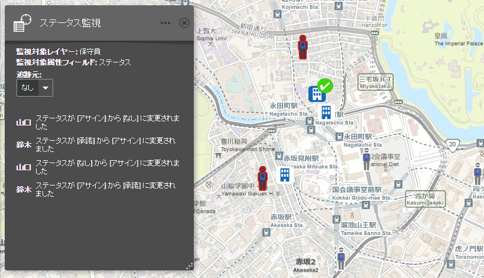

# ステータス監視

フィーチャの属性値の更新を監視して、更新情報をフィード表示します。特定フィーチャの移動追跡も可能です。

※ステータス監視ウィジェットを利用する場合は監視対象となるレイヤーの更新間隔を Web マップ側で設定してください。

## 機能

* 属性値更新の監視とフィード表示（メッセージ表示）
* 特定フィーチャの移動追跡

※多数のフィーチャの属性値が一括で更新されるようなレイヤーを監視する場合はメッセージ表示を OFF にすることを推奨します。

## 動作環境

* Web AppBuilder 1.1

## ライセンス
Copyright 2015 Esri Japan Corporation.

Apache License Version 2.0（「本ライセンス」）に基づいてライセンスされます。あなたがこのファイルを使用するためには、本ライセンスに従わなければなりません。本ライセンスのコピーは下記の場所から入手できます。

> http://www.apache.org/licenses/LICENSE-2.0

適用される法律または書面での同意によって命じられない限り、本ライセンスに基づいて頒布されるソフトウェアは、明示黙示を問わず、いかなる保証も条件もなしに「現状のまま」頒布されます。本ライセンスでの権利と制限を規定した文言については、本ライセンスを参照してください。

ライセンスのコピーは本リポジトリの[ライセンス ファイル](./LICENSE)で利用可能です。

